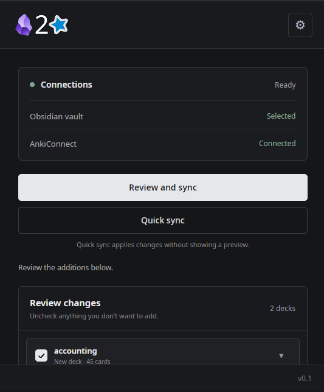
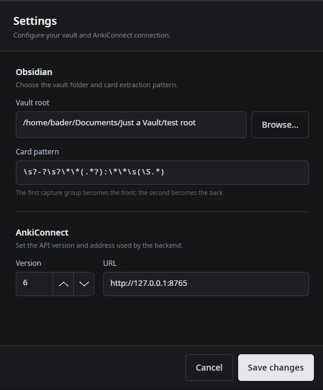

# Obsidian2Anki

An app that turns Obsidian notes into Anki flashcards.

## Screenshots
### Main Window

### Settings


## Requirements 
- Obsidian (technically any folder with .md files would be fine, but Obsidian is the intended use case)
- Anki 
- AnkiConnect (an Anki add-on that exposes a local API used by MD2Anki.)

## What It Does

- Parses your notes using a customizable regular expression.
- Maps folders inside your selected notes directory to Anki decks.
- Adds parsed flashcards from those folders to their corresponding Anki decks.

## Features

- Parse flashcards from Obsidian Markdown files.
- Automatically create Anki decks and cards.
- Preview changes before executing them.
- Configurable note regex.
- Persistent cross-platform settings.
- Local desktop UI built with Avalonia.

## Initial Usage 
1. Open Anki.
2. Open MD2Anki.
3. Set your Obsidian vault path 
4. You can either use the default card pattern which looks like this ( **Mitochondria:** The powerhouse of the cell ) or make your own (though it must contain two capture groups for the question and answer)

with that, setup is complete.

## Installation

### Linux

Download the latest AppImage from the Releases page.

- Enter the app folder.
- Make the app image executable as shown bellow:

```Bash
chmod +x MD2Anki-x86_64.AppImage
```
- Read the README for instructions on how to use. 
### Mac OS

Coming soon 

### Windows 

Download `MD2Anki-win-x64.zip` from the Releases page.

- Extract the folder anywhere you like.
- Run `MD2Anki.exe`.

The build is self-contained, so no .NET runtime or Python install is required. The
backend ships alongside the app in the `backend` folder and is started
automatically, so keep the folder contents together.

## Building from source

### Windows

Requires the [.NET 10 SDK](https://dotnet.microsoft.com/download) and Python 3.12+.

```PowerShell
.\build-windows.ps1
```

This creates the virtual environment, packages the FastAPI backend with
PyInstaller, then publishes the Avalonia front end with the backend bundled into
`dist\MD2Anki-win-x64`. Pass `-SkipBackend` to republish only the front end when
the backend has not changed.

## Tech Stack 
- FastApi (Python) (Backend)
- Avalonia UI (C#/.NET) (Frontend)

## Why I made this + notes on development (read if interested)
Whenever I tried looking up how to make a good project that would be educational and worth while the common advice 
I would see listed is that you should make something you 
- Want to make 
- Would use

I kept feeding my class notes to chatgpt to turn them into a csv that I could import into anki and that was an annoying process as after a long day at university the last thing I want to do is cross reference between anki and obsidian to see what notes I've already imported or not. That's when it hit me that I could automate this whole process and have a fun little project alongside it. 

There have been a lot of firsts for me in this project to be honest its my first real full stack application. For the sake of honesty though I do have to admit that I did vibe code the entire front end, but the backend is all me.I kinda rushed into using Avalonia UI thinking like ok fine I know basic C# so I should be able to tackle a framework in a language I barely understand. This turned out to be a very bad idea so I ended up vibe coding the front end as the main point of interest/learning for me in this project was with the backend. In future I will make a project where the front end came all out of my brain but for now I wanted to ship this project and get it complete (with complete meaning that I can use it for my original context.)

The main mistakes I can attribute to this project are that:
- There were a lot of aspects I didn't account for in conception because I've never taken a project this far before. 
- A lot of terrible architectural decisions that again were made out of a lack of prior experience.
- Many breaks in development that made me completely forget what was the last thing I was working on. 

I am almost certain if I could go back in time and tell myself how the project would end up looking I could have finished this in like 2 weeks max.Though, ultimately in spite of it all that I genuinely am really happy with how this all turned out as I have managed to learn about a lot of libraries I didn't know existed previously and got to finally cement in my head that basic full stack split and whats the difference between the front end and the backend. 
